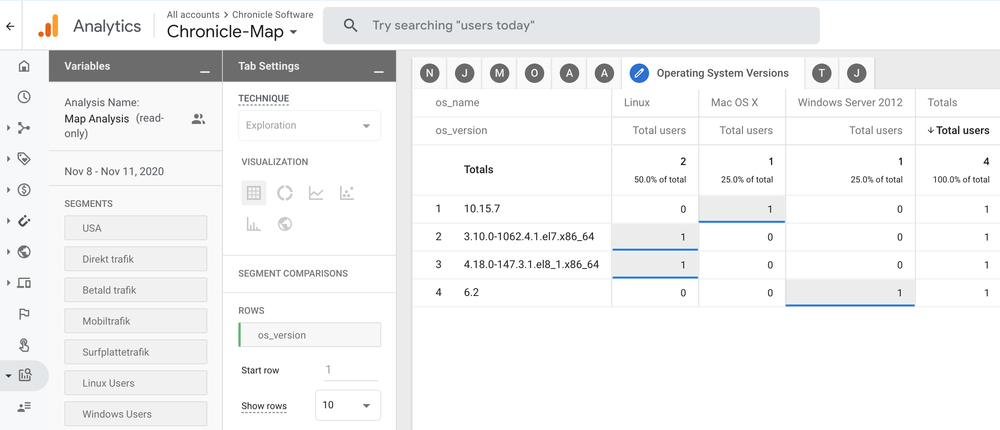

= Chronicle-Analytics

image:https://maven-badges.herokuapp.com/maven-central/net.openhft/chronicle-analytics/badge.svg[Maven Central,link=https://maven-badges.herokuapp.com/maven-central/net.openhft/chronicle-analytics]

This library provides remote input access to Google Analytics 4 allowing usage statistics to be collected for Java applications.

== API

The following example sets up an analytics instance with the *event parameter* `app_version = 1.4.2` and perhaps the *user properties*
`os_name = Linux` and `java_runtime_version = 1.8.0_272-b10` depending on the environment used:

[source, java]
----
public class AnalyticsExample {

    public static void main(String[] args) {

        final Analytics analytics = Analytics.builder("G-TDAZG4CU3G", "k2hL3x2dQaKq9F2gQ-PNhQ")
                .putEventParameter("app_version", "1.4.2")
                .putUserProperty("os_name", System.getProperty("os.name"))
                .putUserProperty("java_runtime_version", System.getProperty("java.runtime.version"))
                .build();

        analytics.sendEvent("started");

        // do some job

        analytics.sendEvent("completed");

    }
}
----

When applications like this one are run, statistics will be gathered by Google Analytics 4 allowing detailed insight as to how, where and when the application is used.

== Google Analytics 4 example

Here is an example of how the data above could be rendered using Google Analytics 4.

== Thread usage

The library is using a single thread named `"analytics-http-client"` to send requests. This thread is initially started on demand and will remain sleeping throughout the lifespan of the JVM.

